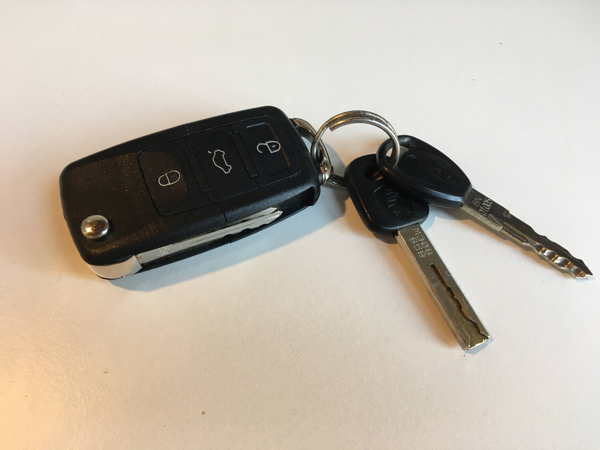
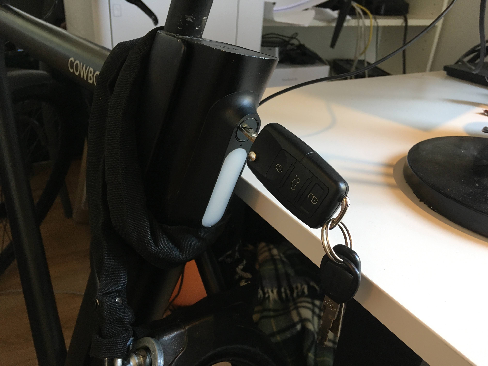
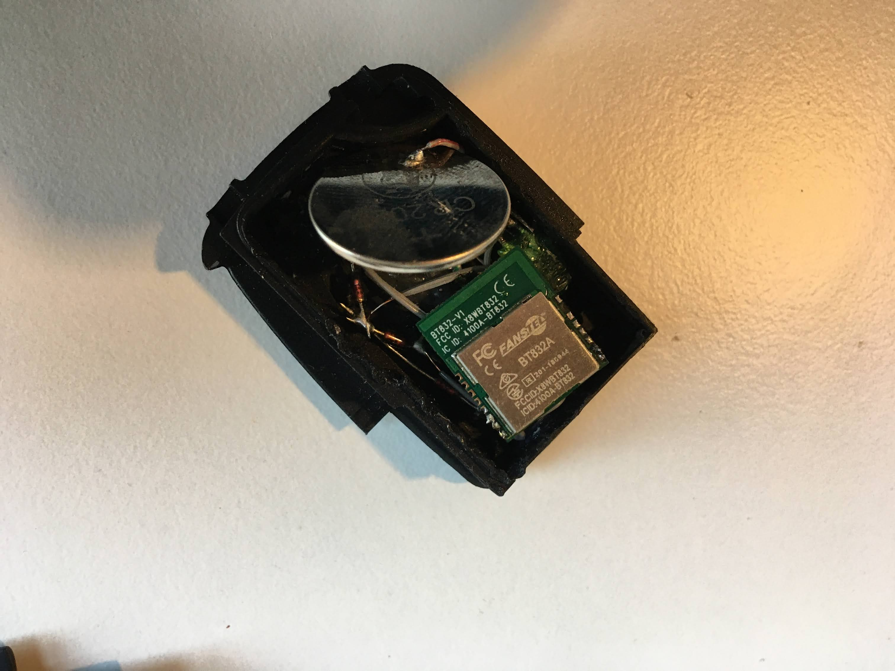
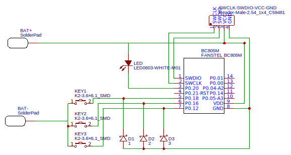
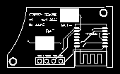

nRF52 Cowboy e-bike remote control fob
====

I wanted to control my awesome Cowboy bike without my phone. I set out to create a car key remote control using a bluetooth SoC.

I'm using a Volkswagen (VW) 3 button key fob. You can find them for about EUR 6 online.

This is a work in progress, the code is terrible, I have very little electronics experience and this is my first ever NRF, BLE or custom PCB project. Not the combination of these three, I've never done any of them before.

This prototype works and I'm using it now.

It's using diodes to only power the SoC when you keep pressing a key.

The next step is to create a proper PCB. You can find the data below. The board should be 1mm thick to fit in the VW enclosure.

## Code

There are two samples, one for ESP32 ( sketch_esp32_cowboy.ino ) which I used to get started. There is also one for the NRF Connect SDK (main.c) which I am using. In the key fob I started using an NRF52805 module (the smallest and cheapest) which works well. It fits better than the BT832A which I used previously.

You will need the mac address and the 6 digit passkey for your bike. This will be hardcoded in the firmware. Using 3 buttons a passkey entry will be tough.

For flashing the SoC you need an NRF52-dk. You can reportedly also use an esp32 to flash, but I've not used it.

## What does it do?

* Long-press on unlock -> turns bike on
* Long-press on lock -> turns bike off
* Long-press trunk -> toggle light on/off
* Long-press trunk + long-press unlock -> go to 24 km/h speed limit
* Long-press trunk + long-press lock -> go to 25 km/h speed limit

Once the action is done, the LED will flash rapidly and the SoC will shut down. You can stop holding the button when you see the flashing.

## Costs

* Lots of time...
* Key enclosure: 6 EUR
* PCB: 0.5 EUR
* BC805M SoC: 4 EUR
* SMD parts: 0.5 EUR
* Sticker: 1 EUR (if you order 50 pieces)

Total: 12 EUR.

So one key is about Naturally there are also S&H costs. In low volumes this is about 2 times the component costs.

## Schematic

NOTE: The PCB design is untested, I'm waiting for the shipments.

UPDATE: the PCB has some minor problems, like the pin-hole alignment in the bottom left corner, and the height of some of the switches is wrong for some reason. Other than that, it seems to be working fine.

I designed this using easyeda.com and ordered the PCB and components through their site.

In the pcb-design folder you'll find the Gerber files for the enclosure.

## How can you help?

If you see stupid mistakes or other room for improvement, let me know! I'm a n00b.

## Do you need help?

Submit an issue if you need some pointers to get it to work, but I give 0 guarantees or warranty.

## The key stickers

On the back of the key fob you can place a 14mm sticker. These are called Doming 3D stickers and can be ordered in NL from e.g:

* https://mijn.stickerwinkel.com/
* https://www.drukwerkdeal.nl/nl/delivery

The Cowboy logo is included in this repo if you want to order.

Stickers cost about 60 euros for 1 to 50 pieces...
